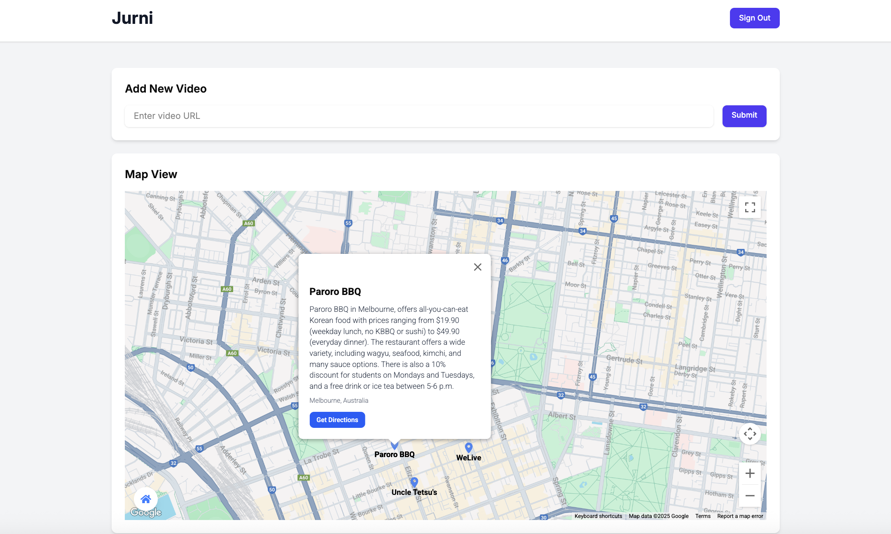
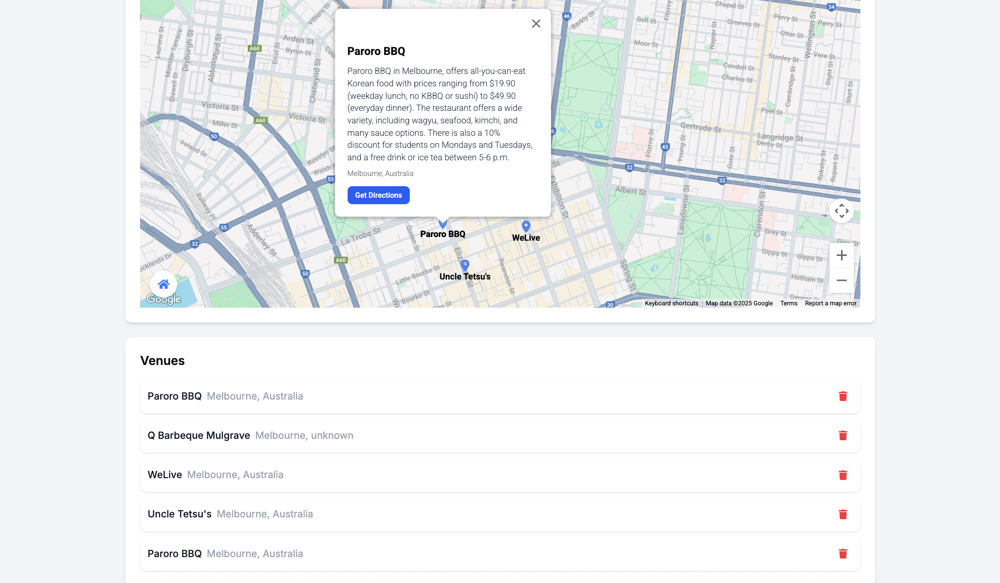

# Jurni - Video Location Analysis Platform

Jurni is a web application that analyzes videos to extract location and venue information, displaying them on an interactive map.

## Screenshots





## Features

- **Video Analysis**: Submit video URLs for automated analysis
- **Location Extraction**: Uses Google Gemini AI to analyze videos and extract location data
- **Interactive Map**: Displays venues on a Google Map with real-time updates
- **Real-time Updates**: Live updates when venues are added or removed
- **User Authentication**: Secure login and registration system

## Tech Stack

- **Frontend**: Next.js 15, React 19, TypeScript
- **Styling**: Tailwind CSS
- **Database**: Supabase (PostgreSQL)
- **Authentication**: Supabase Auth
- **Background Jobs**: BullMQ with Redis
- **Maps**: Google Maps API
- **AI Analysis**: Google Gemini AI

## Project Structure

```
jurni/
├── app/                    # Next.js app directory
│   ├── api/               # API routes
│   ├── components/        # React components
│   ├── dashboard/         # Dashboard pages
│   └── login/            # Authentication pages
├── lib/                   # Utility functions
├── src/                   # Source code
│   └── types/            # TypeScript type definitions
├── supabase/             # Supabase configuration
└── worker.js             # Background job processor
```

## Getting Started

1. Clone the repository
2. Install dependencies:
   ```bash
   npm install
   ```
3. Set up environment variables:
   - Create `.env.local` with required keys
   - See `.env.example` for required variables
4. Start the development server:
   ```bash
   npm run dev
   ```
5. Start the worker:
   ```bash
   npm run worker
   ```

## Environment Variables

Required environment variables:
- `NEXT_PUBLIC_SUPABASE_URL`
- `NEXT_PUBLIC_SUPABASE_ANON_KEY`
- `SUPABASE_SERVICE_ROLE_KEY`
- `NEXT_PUBLIC_GOOGLE_MAPS_API_KEY`
- `GEMINI_API_KEY`
- `REDIS_HOST`
- `REDIS_PORT`
- `REDIS_PASSWORD`

## Development

- `npm run dev`: Start development server
- `npm run build`: Build for production
- `npm run start`: Start production server
- `npm run worker`: Start background job processor
- `npm run lint`: Run ESLint

## Contributing

1. Fork the repository
2. Create a feature branch
3. Commit your changes
4. Push to the branch
5. Create a Pull Request

## License

[MIT License](LICENSE) 